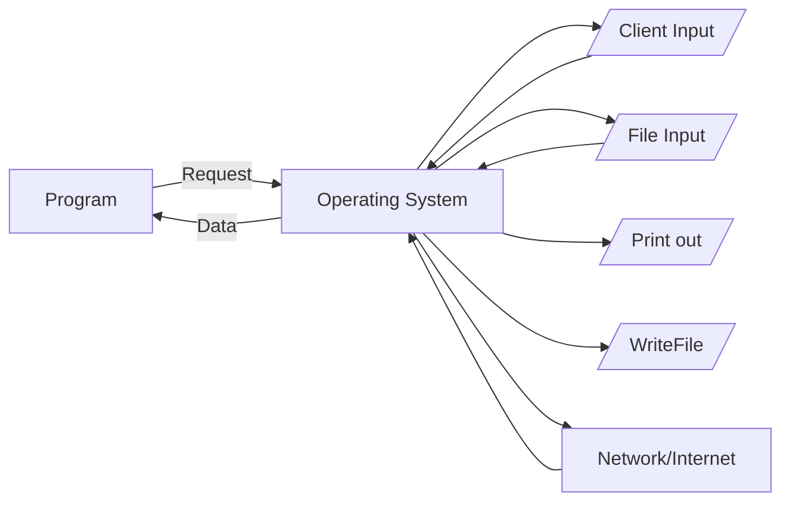
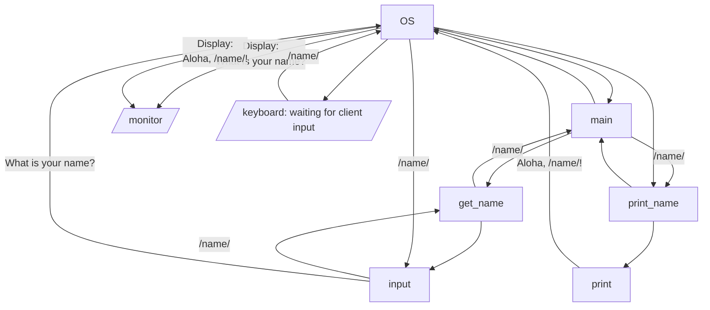

# Module 08 - Error Handling and Files

When we work with a program in python, we often forget that we are not interacting directly with a client. Instead,
we are interacting with an operating system which may or may not give us the answer we need at that moment!

Why? Because programs are running in mostly isolated instances on the operating system, and to handle all the various
requests from multiple programs, the OS has to intervene to manage those requests. Arguably, the OS for this
reason is the most important program on any computer (and why there is a whole field of systems research).



Thinking about programs in this can, and actually modify the flowchart for our code. While we don't often write
it this way, let's look at it this way for better understanding. 

```python
def get_name() -> str:
    """
    Requests the name from the client, and returns it, stripped and cleaned. 
    
    Returns (str):
        Returns a string of the name with the leading and trailing whitespaces removed
    """
    return input("What is your name? ").strip()

def print_name(name: str, msg: str = "Aloha, {name}!") -> None:
    """
    Prints the name to the screen, with the welcome message. 
    
    Arguments:
        name (str): the name of the person to welcome
        msg (str): The name of the message, assumes a message format with the name variable in it. 
                   Defaults to "Aloha, {name}"
    """
    print(msg.format(name))
    
def main():
    name = get_name()
    print_name(name)
```

This program looking from the OS perspective, could be the following:



That is a lot going on, and it doesn't even include the calls to  memory allocation (storing of variables)! Needless
to say, your program is only one small part of a very large ecosystem. 

> Discussion:  
> Discuss this ecosystem. Why would it need to exist this way? Why couldn't your program talk to the 
> keyboard directly?


## Try/Except  - Error Handling
The problem is when do you trust or not trust this ecosystem? 

The general answer -- whenever you get something from the system -- check your result.

* Getting input from a client that needs to be in a certain format - check for errors
* Getting input from a file that needs to be in a certain format - check for errors
* Getting input from a network/interacting with a network - check for errors
* Trying to read a file - check for errors (it may not even exist!)

What happens is **exceptions** are **raised** when issues happen. This is why in python the try/except block exists. In
english, you are saying try this block of code, but if an exception is raised, run this block of code. These exceptions 
are both from the operating system, but also internal to various functions. For example, you all probably have
seen a [TypeError] when you try to add a string to an int.

```python 
print("Hello Johnny " + 5) # this would raise a type error!
```
Try the above code in the python console if you don't recall!

```text
>>> print("Hello Johnny " + 5)
Traceback (most recent call last):
  File "<stdin>", line 1, in <module>
TypeError: can only concatenate str (not "int") to str
```

> Discussion  
> What are some Errors you have seen? How many can you list?

### When to use Try/Except
You could fill your code with try/except statements, but that is often overkill. Instead, the general rule is:
1. Use try/except when dealing with input from the OS (files, network, keyboard)
2. Use try/except when you need specific types and are converting from types that may not match (str to anything)

There are other cases that you will learn as you learn more about designing applications, but those are the most common. 

### Example: Keyboard input and convert

When we get input from a client, we know that is usually pretty solid, but we also know **you never trust your client**.
Sounds horrible, but whether it is intentional or not, input breaks programs. As such, let's take a program
that requires clients to enter an integer number (sound familiar)?

```python
def get_age() -> int:
    age = input("What is your age? ").strip()
    return int(age)
```

The above code will crash, if they type things like "forty-two" instead of 42. As such, we want to be defensive in our
code. We could use the .isnumeric(), and in this case it would work, but it forces checks in the code. Instead, we could
combine recursion and type checks to make our code smooth.

```python 
import sys


def get_age() -> int:
    try:
        age = input("What is your age? ").strip()
        iage = int(age)
    except ValueError:
        print("invalid value! must be a whole number", file=sys.stderr)
        return get_age()
    return iage
```
[Visualize This Age Example] in Python Tutor. You can also click edit the code, modify it, and rerun it, so 
you can see how it works if you keep entering invalid ages.  This design pattern is considered a lazy pattern
as it assumes everything is ok, until an exception is raised. 

> Also, notice the `file=sys.stderr`. This is common, as you are printing to the 'error log' though 
for most consoles, that is directly to the console. You can read more about it (very in depth) at 
[Geeks for Geeks: Stderr]

#### 📝 TASK - Getting Valid Numbers
As a group write a function `get_valid_int(prompt: str)->int`, that takes in a string for an argument. 
Prompts the client with that argument, and returns a valid int. You should not 
check for ranges (greater than O or anything), just that is a valid int.  However, the catch is they can also 
type in a float number, and it will be converted to an int. You are free to split this into two functions
`get_valid_float(prompt: str)->float` and `get_valid_int(prompt: str)->int`. When you split it, how can you
minimize code duplication? 

### Design Discussion

When you use string split, it returns string values in each location  of your list. The problem is that you often
don't want string values, so converting is important.  The question then becomes where is it best to place
your try/except statements. Inside the function that converts, or the function that calls the convert function.
The real answer depends on where do you handle the error at!

Let's assume the following function:

```python
import sys


def convert(values: str) -> tuple:
    """
     Breaks a string of format City,Latitude,Longitude
     converts it to a tuple of City,Latitude,Longitude - str,float,float
    """
    try:
        value_list = values.split(",")
        if len(value_list) < 3: return tuple([])  # return the empty tuple if something isn't correct 
        name, lat_s, lon_s = value_list  # not required, just easier to read
        lat = float(lat_s)
        lon = float(lon_s)
    except ValueError:
        print(f"Value error with ({values}).", file=sys.stderr)
        return tuple([]) # return the empty list
    return name, lat, lon 

def main():
    neu_locations = ("Boston,42.3395683,-71.0922272",
                     "San Francisco,37.79292,-122.4068792",
                     "Vancouver,49.2806832,-123.1178707")
    for location in neu_locations:
        converted = convert(location)
        if converted: # an empty list will be False 
            print(type(converted[1]))
```

In the example above, the function returns an empty list, so and the resulting code has to check for that. It also
means an empty list has no meaning. That is fine, and one way to look at it. Another way to look at it is
that convert should raise the error on up. 

```python
import sys 


def convert(values: str) -> tuple:
    value_list = values.split(",")
    if len(value_list) < 3: raise AttributeError("You need a list of the format Name,Latitude,Longitude.")
    name, lat_s, lon_s = value_list  # not required, just easier to read
    lat = float(lat_s)
    lon = float(lon_s)
    return name, lat, lon

def main():
    neu_locations = ("Boston,42.3395683,-71.0922272",
                     "San Francisco,37.79292,-122.4068792",
                     "Vancouver,49.2806832,-123.1178707")
    for location in neu_locations:
        try:
            converted = convert(location)
            print(type(converted[1]))
        except ValueError:
            ... # means just skip it, but don't crash the program
        except AttributeError as a:
            print(a, file=sys.stderr) # print the error message and do nothing else, don't end program
```
Try running the above code, and work on changing the values in neu_locations so that exceptions are intentionally
raised. 

> Discussion:  
> Which versions do you like better, and why? What are the disadvantages and advantages of each?


## File Handling
File handling is a place where try/except statements are used regularly. Given what you learned above:

> Discuss  
> Why would you want try/except statements with handling (reading/writing) files? What are some common errors
> that may happen? (don't worry about the name of the error, just use your own words)

### Reading and Writing Files
Reading and writing are covered in the course videos. A typical reading with try/catch is

```python
import sys

try:
    file = open("poems.txt", 'r')  # open a file for reading
    for line in file:
        print("line: " + line.strip())
    file.close()
except IOError:
    print("Error accessing poems.txt", file=sys.stderr)
```

The same is true with writing files, but instead you use the 'w' attribute to say it is a file to write. For every
file, you have an open, close, and usually a way to access the contents. 

However, there is also a more "python" way of doing it is using what is called a context manager. 

```python 
try:
    with open("poems.txt", 'r') as file: 
        for line in file:
            print("line: " + line.strip())
except FileNotFoundError:
    print("Poems.txt not found!")
except IOError as a:
    print(a)
```

The `with` keyword is critical, as are the indents. It automatically closes the file when done reading. Everything
inside the with block has access to the file variable, and when the block is done, the file is closed. This is the 
preferred way to handle files in python.

### Reading and processing?

A common question is when reading files is how much should one do when reading the file. The answer tends to be:
1. Unless the file is too large, read it into a list, manipulate that list/tuple.
2. If the file needs converted (strings turned to ints for example), convert it, then load those values into a list/tuple.

As such, let's say you have a bunch of numbers in a file, that need to be floats. You could write something like the
following.

```python 
def load_file(file_name: str) -> tuple:
    values = [] # set up an empty list to return, even if the file is not found
    try:
        with open(file_name) as file: # read is default and can be left off
            for line in file:
                try:
                    values.append(float(line.strip()))
                except ValueError:
                    pass # skip that line, maybe good to print an error, but decided not to this time
    except FileNotFoundError:
        print(f"{file_name} not found!")
    except IOError as io:
        print(io)
    return tuple(values)
```

> Discussion:
> Discuss the above code. What parts make sense, what parts could use more elaboration. What benefits
> would this have for the greater program? For a deeper connection, how does this help
> other functions to be pure functions?

#### 📝 TASK - Try it out
Take the  above code, and try it out on a "dummy file" you create. Dummy files are common for testing file reading
code. They are just files you create with arbitrary data!! Also write some other functions that can use
the results generated by load_file, so that you can properly test the loaded files. What happens when you
add non-floats in the file?

For example, you could create a file called `test1.txt`, adding in the file the following data:

```
10
10.5
11
-10.2
1
```

and one called `test2.txt` with
``` 
1
1
1
```

After you have had a chance to experiment, lookat [file_loader.py](file_loader.py). Go ahead and download
all the files, and run it. Why did we not run into a divide by 0 error?

However, the function average() is not very defensive, update it to make sure a divide by 0 doesn't happen - you don't
need try/except!

## Coding Practice
Now work on a module coding practice together! Discuss how and why you choose different things for your implementation. 


[TypeError]: https://www.geeksforgeeks.org/handling-typeerror-exception-in-python/
[Visualize This Age Example]: https://pythontutor.com/visualize.html#code=def%20get_age%28%29%20-%3E%20int%3A%0A%20%20%20%20try%3A%0A%20%20%20%20%20%20%20%20age%20%3D%20input%28%22What%20is%20your%20age%3F%20%22%29.strip%28%29%0A%20%20%20%20%20%20%20%20iage%20%3D%20int%28age%29%0A%20%20%20%20except%20ValueError%3A%0A%20%20%20%20%20%20%20%20print%28%22invalid%20value!%20must%20be%20a%20hole%20number%22%29%0A%20%20%20%20%20%20%20%20return%20get_age%28%29%0A%20%20%20%20return%20iage%0A%0Aget_age%28%29&cumulative=false&curInstr=17&heapPrimitives=nevernest&mode=display&origin=opt-frontend.js&py=3&rawInputLstJSON=%5B%22five%22,%2210%22%5D&textReferences=false
[Geeks for Geeks: Stderr]: https://www.geeksforgeeks.org/how-to-print-to-stderr-and-stdout-in-python/