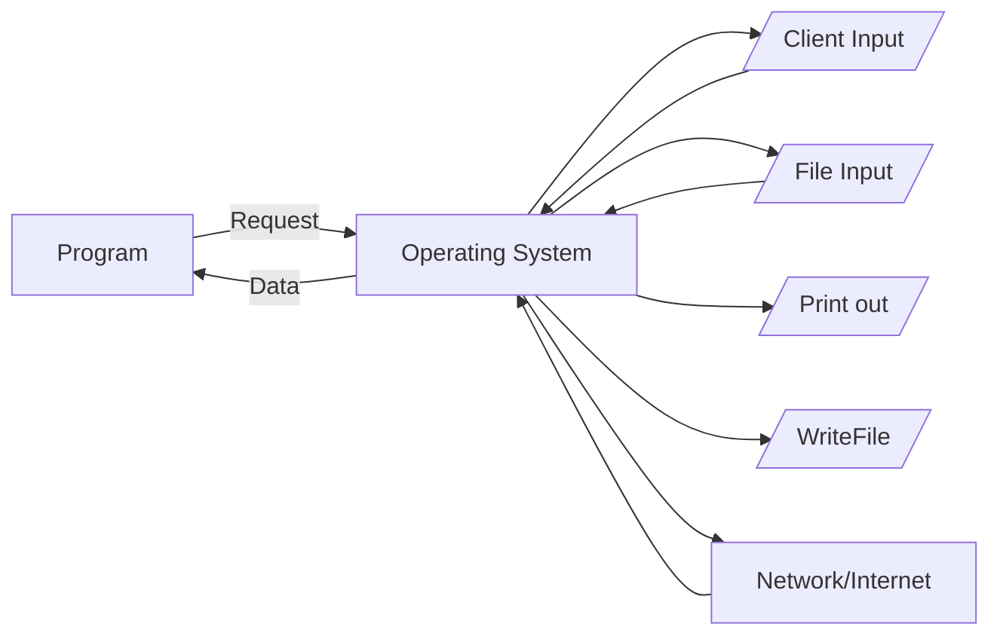
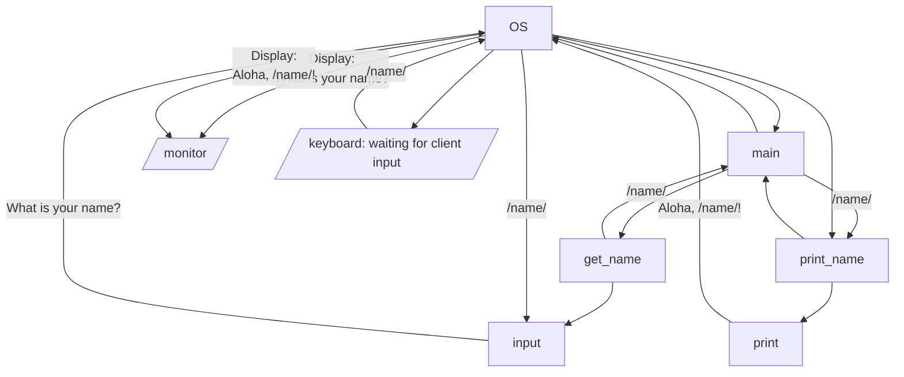

# Module 08 - Error Handling and Files

When we work with a program in python, we often forget that we are not interacting directly with a client. Instead,
we are interacting with an operating system which may or may not give us the answer we need at that moment!

Why? Because programs are running in mostly isolated instances on the operating system, and to handle all the various
requests from multiple programs, the OS has to intervene to manage those requests. Arguably, the OS for this
reason is the most important program on any computer (and why there is a whole field of systems research).



Thinking about programs in this can, and actually modify the flowchart for our code. While we don't often write
it this way, let's look at it this way for better understanding. 

```python
def get_name() -> str:
    """
    Requests the name from the client, and returns it, stripped and cleaned. 
    
    Returns (str):
        Returns a string of the name with the leading and trailing whitespaces removed
    """
    return input("What is your name? ").strip()

def print_name(name: str, msg: str = "Aloha, {name}!") -> None:
    """
    Prints the name to the screen, with the welcome message. 
    
    Arguments:
        name (str): the name of the person to welcome
        msg (str): The name of the message, assumes a message format with the name variable in it. 
                   Defaults to "Aloha, {name}"
    """
    print(msg.format(name))
    
def main():
    name = get_name()
    print_name(name)
```

This program looking from the OS perspective, could be the following:



That is a lot going on, and it doesn't even include the calls to  memory allocation (storing of variables)! Needless
to say, your program is only one small part of a very large ecosystem. 

> Discussion:  
> Discuss this ecosystem. Why would it need to exist this way? Why couldn't your program talk to the 
> keyboard directly?


## Try/Except  - Error Handling
The problem is when do you trust or not trust this ecosystem? 

The general answer -- whenever you get something from the system -- check your result.

* Getting input from a client that needs to be in a certain format - check for errors
* Getting input from a file that needs to be in a certain format - check for errors
* Getting input from a network/interacting with a network - check for errors
* Trying to read a file - check for errors (it may not even exist!)

What happens is **exceptions** are **raised** when issues happen. This is why in python the try/except block exists. In
english, you are saying try this block of code, but if an exception is raised, run this block of code. These exceptions 
are both from the operating system, but also from internal to various functions. For example, you all probably have
seen a [TypeError] when you try to add a string to an int.

```python 
print("Hello Johnny " + 5) # this would raise a type error!
```
Try the above code in the python console if you don't recall!

```text
>>> print("Hello Johnny " + 5)
Traceback (most recent call last):
  File "<stdin>", line 1, in <module>
TypeError: can only concatenate str (not "int") to str
```

> Discussion  
> What are some TypeErrors you have seen? How many can you list?

### When to use Try/Except
You could fill your code with try/except statements, but that is often overkill. Instead, the general rule is:
1. Use try/except when dealing with input from the OS (files, network, keyboard)
2. Use try/except when you need specific types and are converting

There are other cases that you will learn as you learn more about designing applications, but those are the most common. 

### Example: Keyboard input and convert

When we get input from a client, we know that is usually pretty solid, but we also know **you never trust your client**.
Sounds horrible, but whether it is intentional or not, input breaks programs. As such, lets take a program
that requires clients to enter an integer number (sound familiar)?

```python
def get_age() -> int:
    age = input("What is your age? ").strip()
    return int(age)
```

The above code will crash, if they type things like "forty-two" instead of 42. As such, we want to be defensive in our
code. We could use the .isnumeric(), and in this case it would work, but it forces checks in the code. Instead, we could
combine recursion and type checks to make our code more smooth. 

```python 
def get_age() -> int:
    try:
        age = input("What is your age? ").strip()
        iage = int(age)
    except ValueError:
        print("invalid value! must be a hole number")
        return get_age()
    return iage
```
[Visualize This Age Example] in Python Tutor. You can also click edit the code, modify it, and rerun it, so 
you can see how it works if you keep entering invalid ages.  This design pattern is considered a lazy pattern
as it assumes everything is ok, until an exception is raised. 


#### 📝 TASK
As a group write a function `get_valid_int(prompt: str)->int`, that takes in a string for an argument. 
Prompts the client with that argument, and returns a valid int. You should not 
check for ranges (greater than O or anything), just that is a valid int.  However, the catch is they can also 
type in a float number, and it will be converted to an int. 


[TypeError]: https://www.geeksforgeeks.org/handling-typeerror-exception-in-python/
[Visualize This Age Example]: https://pythontutor.com/visualize.html#code=def%20get_age%28%29%20-%3E%20int%3A%0A%20%20%20%20try%3A%0A%20%20%20%20%20%20%20%20age%20%3D%20input%28%22What%20is%20your%20age%3F%20%22%29.strip%28%29%0A%20%20%20%20%20%20%20%20iage%20%3D%20int%28age%29%0A%20%20%20%20except%20ValueError%3A%0A%20%20%20%20%20%20%20%20print%28%22invalid%20value!%20must%20be%20a%20hole%20number%22%29%0A%20%20%20%20%20%20%20%20return%20get_age%28%29%0A%20%20%20%20return%20iage%0A%0Aget_age%28%29&cumulative=false&curInstr=17&heapPrimitives=nevernest&mode=display&origin=opt-frontend.js&py=3&rawInputLstJSON=%5B%22five%22,%2210%22%5D&textReferences=false