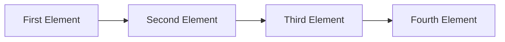
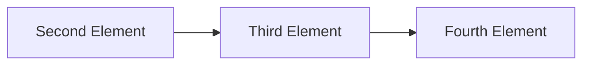
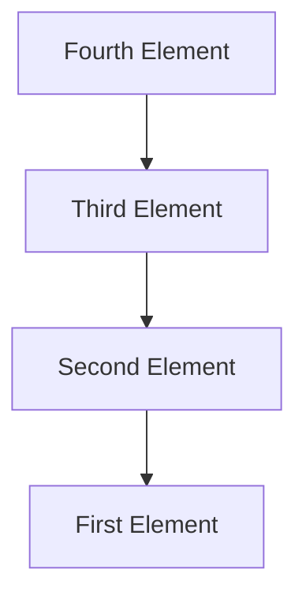
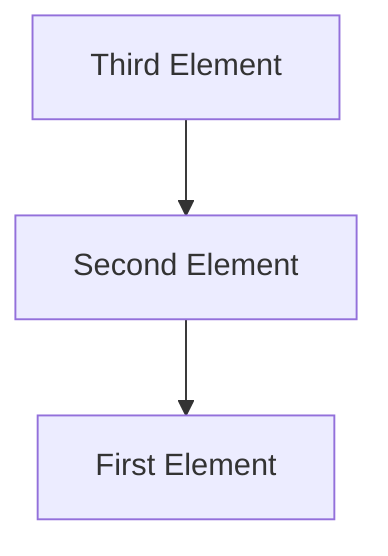

# Module 11 - FIFO and LIFO

In computer science, you will often hear FIFO and LIFO. These are acronyms for First In First Out and Last In First Out. These are two different ways of organizing data. In this module, we will explore these two different ways of organizing data. How you organize the data in your program can greatly reduce the amount of time it takes to complete a task. This is just a glimpse of what you will really dive into in future courses! 

## First In First Out - A Queue
Often called "first come first served", a queue is a data structure where the first element added to the queue will be the first element removed from the queue. This is a very common data structure in computer science.

If we have a queue, and we have four elements, we can visualize it like the following:
```python
queue.add("First Element")
queue.add("Second Element")
queue.add("Third Element")
queue.add("Fourth Element")
```




If we were to remove an element from the queue, we would remove the first element added to the queue. In this case, we would remove "First Element". The queue would then look like the following:

```python
queue.remove()
```





### Discussion
Think of cases were you would use a queue. What are some examples of a queue in real life?

To get you thinking more about a queue, here are some examples in computer science:
* A printer queue - The first document you send to the printer will be the first document printed.
* A keyboard buffer - The first key you press will be the first key processed. This is actually called a circular buffer, but it is a specialized queue that optimizes memory.
* A network packet buffer - The first packet that arrives at the network will be the first packet processed.

### Code
Now lets look at the code of the queue. Often we will wrap our queue structure inside of a class.

```python
class Queue:
    def __init__(self):
        self.queue = []

    def add(self, item):
        self.queue.append(item)

    def remove(self):
        if len(self.queue) == 0:
            return None
        return self.queue.pop(0)
```

Take a moment to draw out the visualizations of the queue. What do you think the code is doing? Which side are new items being added to? Which side are items being removed from?


## Last In First Out - A Stack
A stack is a data structure where the last element added to the stack will be the first element removed from the stack. This is also a very common data structure in computer science.

> Fun Fact:   
> A stack was named after the stack of plates you would use at a restaurant. The first plate you put on the stack is the last plate you would take off the stack. 


If we have a stack, and we have four elements, we can visualize it like the following:
```python
stack.push("First Element")
stack.push("Second Element")
stack.push("Third Element")
stack.push("Fourth Element")
```
    


If we want to remove an element (often called a pop), we would remove the last element added to the stack. In this case, we would remove "Fourth Element". The stack would then look like the following:

```python
stack.pop()
```



### Discussion
Think of cases were you would use a stack. What are some examples of a stack in real life?

To get you thinking more about a stack, here are some examples in computer science:
* A call stack - The last function you called will be the first function to return. Think about that with every program you write, every time a function is called, it gets to moved to the stack to be processed. When the function returns, it is popped off the stack. **This is a very important concept in computer science.**
* Undo/Redo - The last action you took will be the first action to undo. This is a very common feature in many applications.
* A browser history - The last page you visited will be the first page to go back to.


### Code

Now lets look at the code of the stack. Often we will wrap our stack structure inside of a class.

```python
class Stack:
    def __init__(self):
        self.stack = []
    
    def push(self, item):
        self.stack.append(item)

    def pop(self):
        self.stack.pop()
```

Take a moment to draw out the visualizations of the queue. What do you think the code is doing? Which side are new items being added to? Which side are items being removed from?


## Task

To get some practice, lets write a program that reads in a file, and either stores that file into a queue or a stack. Then the program will print out the contents of the queue or stack. Since we are doing this as a group, try to break up the tasks between the group members.
* 1 person - focuses on the queue
* 1 person - focuses on the stack
* 1 person - focuses on reading in the file. Make sure to take in both a file name and a queue or stack.
* 1 person - focuses on 'gluing' the code together and printing out the contents of the queue or stack.
* everyone - focuses on testing it

Dividing up tasks is common in development. It is important to know how to work with others. It is also important to know how to work on your own. 


## Finally
Check-in with each other on how your final project is going. 